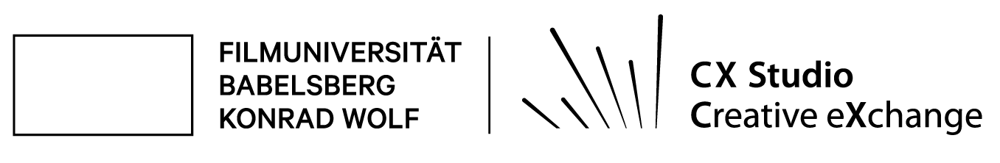
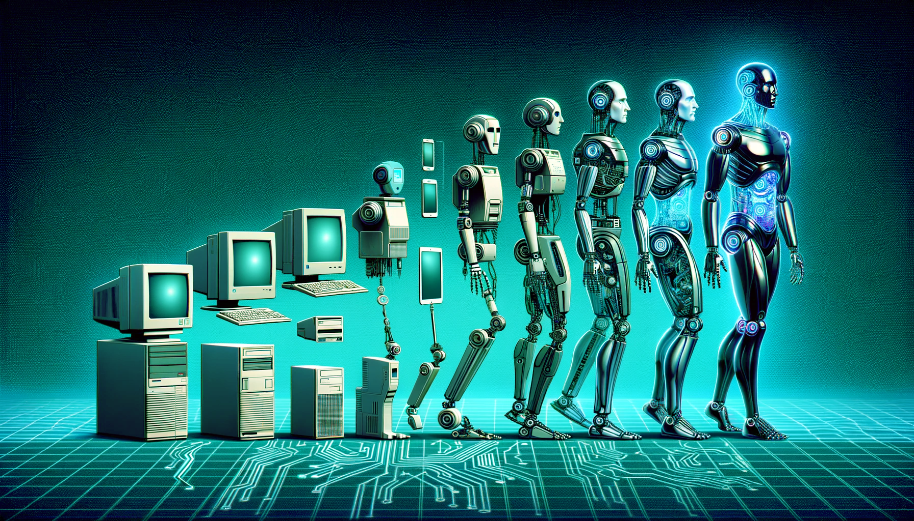
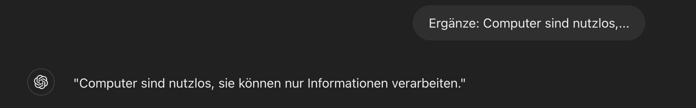
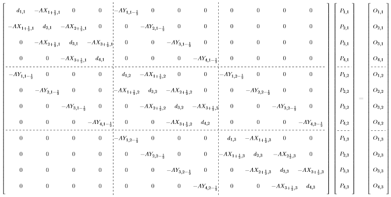
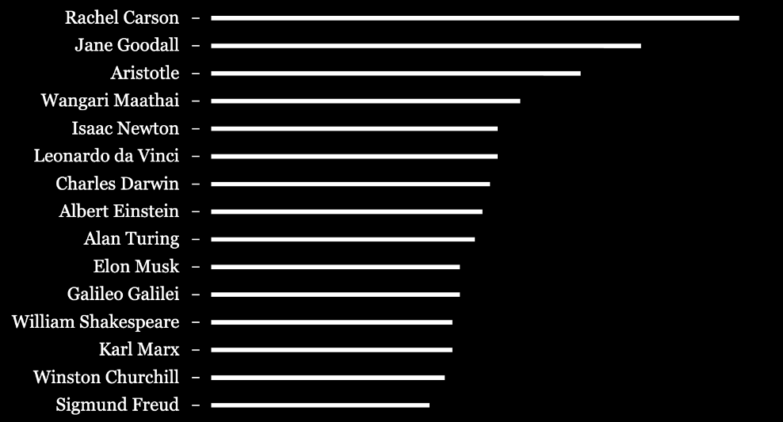
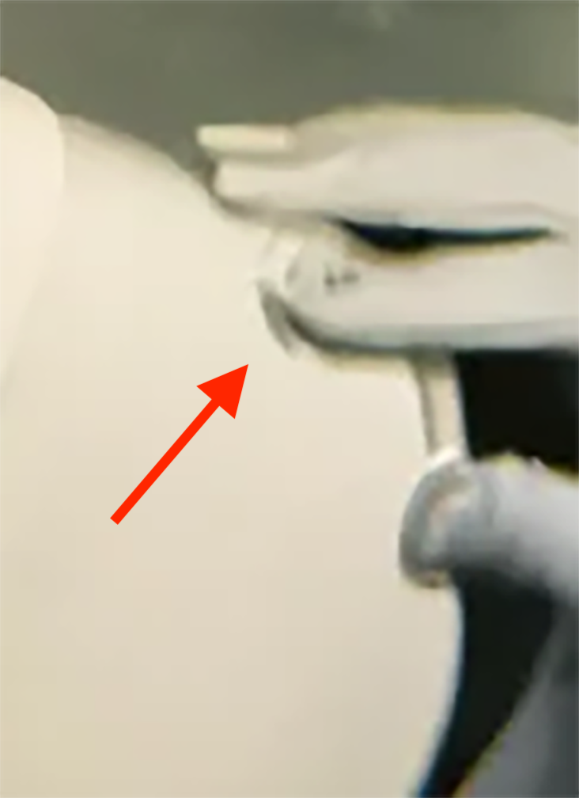
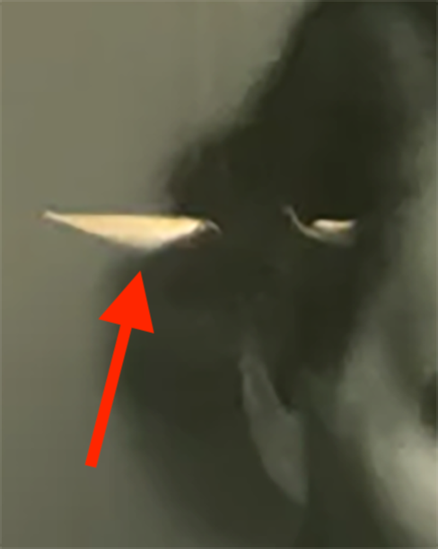

name: inverse
layout: true
class: center, middle, inverse
---

.center[]

  
# *KI – Über was sprechen wir?*

### Prof. Dr. Lena Gieseke

#### 07.11.2024 | Wirklichkeiten gestalten: KI in der Jugendmedienarbeit

???
.task[COMMENT:]  

[...]

Ich starte mit einem kleinen Experiment, dass Sie erst mal nur mit zu machen brauchen, im Laufe meiner Präsentation, gibt es die Auswertung.

Und zwar möchte ich, dass Sie sich merken oder auch lernen, dass wenn ich...

---

# Apa Khabar?

???
.task[COMMENT:]  

... apa kabar frage, Sie mit...

--

# Baik!

???
.task[COMMENT:]  

...baik antworten. Wenn Sie die Worte nicht verstehen, gut. Das ist Teil des Experiments. Wenn sie sie verstehen, bitte behalten sie es für sich.

Genauso, wenn ich...

---

# Satu Dua?

???
.task[COMMENT:]  

... satu dua frage, Sie mit...

--

# Tiga!

???
.task[COMMENT:]  

...tiga antworten. Das über wir noch mal kurz....

Merken Sie sich die Antworten, wir kommen darauf zurück. Zunächst einmal werde ich heute auf...

---
layout:false

## Agenda

* Begriffsklärung & Grundlagen 

???
.task[COMMENT:]  

...Begrifflichkeiten und ein paar Grundlagen zu Thema KI eingehen, wie zum Beispiel...

--
* Maschinelles Lernen & ChatGPT

???
.task[COMMENT:]  

...auf Machinelles Lernen anhand von ChatGPT. Danach gehe ich auf ein Beispiel der...

--
* Bildgenerierung

???
.task[COMMENT:]  

...Bildgenerierung ein.

Ich habe mit meinem Impuls das Ziel ein intuitives Verständnis jenseits des Hypes zu vermitteln.

---
layout: false

## Künstliche Intelligenz

.center[]

.footnote[[L. Gieseke, ChatGPT 4o]]

???
.task[COMMENT:]  

Also, stehen Roboter und Algorithmen kurz davor die besseren Menschen zu werden?

Die tatsächlich aktuell verfügbaren Möglichkeiten...

---
.header[Begriffsklärung & Grundlagen]

## Schwache KI

???
.task[COMMENT:]  

... fallen unter den Begriff der schwachen KI, was bedeutet, dass...

...bestimmte Aufgaben....

---
.header[Begriffsklärung & Grundlagen]

## Schwache KI

* Wahrnehmen
* Kommunizieren
* Planen
* Schlussfolgern
* Lernen

???
.task[COMMENT:]  

typisch menschlicher Kernfähigkeiten genauso gut oder besser als von Menschen erledigt werden.

Aktuell stehen hier...

---
.header[Begriffsklärung & Grundlagen]

## Schwache KI

* Wahrnehmen
* Kommunizieren
* Planen
* Schlussfolgern
* **Lernen**

???
.task[COMMENT:]  

vor allem durch Daten selbstlernende Systeme im Fokus.

Lernen kann man als...  

--

> Lernen ist ein Prozess, durch den ein System die eigene Leistung auf Grund von Erfahrungen verbessert. - Herbert Simon

???
.task[COMMENT:]  

...einen Prozess beschreiben, durch den ein System die eigene Leistung auf Grund von Erfahrungen bzw. Daten verbessert.

*Optinal*
* Herbert Alexander Simon (June 15, 1916 – February 9, 2001) was an American economist, political scientist and cognitive psychologist, whose primary research interest was decision-making within organizations and is best known for the theories of "bounded rationality" and "satisficing".[5] He received the Nobel Prize in Economics in 1978 and the Turing Award in 1975.
* Intelligence: reason, learn, plan, solve problems

---
template:inverse

# Maschinelles Lernen

???
.task[COMMENT:]  

Machinen können aktuelle sehr beeindruckend lernen...

---
## Generative KI

 

.center[]

.footnote[[L. Gieseke, Canva]]

???
.task[COMMENT:]  

...z.B. Texte schreiben oder audiovisuelle Inhalte generieren.

Und wie funktioniert das? Bevor ich darauf eingehen, noch einmal kurz zurück zu unserem Experiment...

---
template:inverse

# Apa Khabar?

--
# Baik!

---
template:inverse

# Satu Dua?

--
# Tiga!

---
template:inverse

# ChatGPT

---

## ChatGPT

???
.task[COMMENT:]  

...ChatGPT ganz grundsätzlich erklären.

--------

* [Wiki](https://www.wikiwand.com/en/ChatGPT): ChatGPT is built on OpenAI's proprietary series of generative pre-trained transformer (GPT) models and is fine-tuned for conversational applications using a combination of supervised learning and reinforcement learning from human feedback.

---

## ChatGPT

OpenAI

???
.task[COMMENT:]  

ChatGPT ist ein Produkt der Firma OpenAI, eine Forschungseinrichtung...

--
* Forschungseinrichtung, (non-profit &) for-profit 

???
.task[COMMENT:]  

... mit offiziell non-profit & for-profit Aktivitäten, wobei meiner Einschätzung nach der non-profit Bereich nicht wirkliche Relevanz haben wird. Zum Stichwort Relevanz, falls ihnen ChatGPT wie ein Hype vorkommt, kann ich ihnen sagen, der Hype ist war, ChatGpT ist nämlich...

--
* Die sich am schnellsten verbreitende Verbraucher-Software der Geschichte

???
.task[COMMENT:]  

...die sich am schnellsten verbreitende Verbraucher-Software der Geschichte.

------

* Unternehmensbewertung $86 Milliarden
* Z.B. Microsoft hat über $10 Milliarden investiert

---
.header[ChatGPT]

## Funktionsweise

???
.task[COMMENT:]  

* Experiment aus 1948 vom Mathematiker Claude Shannon

--

Ergänze:

> Computer sind nutzlos,...
  

???
.task[COMMENT:]  

* Suche den Satz in einem Buch und nehme was danach kommt.

--
  
Antworten:

* ...wenn sie keinen Strom haben.

--
* ...sie können einem nur Antworten geben.

--
* ...wenn sie kaputt sind.

---
.header[ChatGPT]

## Funktionsweise

Ergänze:

> Computer sind nutzlos,...
  
Antworten:

* ...wenn sie keinen Strom haben. → 80 Punkte
* ...sie können einem nur Antworten geben. → 50 Punkte
* ...wenn sie kaputt sind. → 10 Punkte

---
.header[ChatGPT]

## Funktionsweise

> Die Wahrscheinlichkeit von bestimmten Buchstabenreihenfolgen werden katalogisiert.

???
.task[COMMENT:]  

--------

* Die statistische Substruktur von Sprache
* Die Menge der Trainingsdaten entspräche ausgedruckt "hunderttausenden von Büchern".
* Reinforcement learning, damit sich ChatGPT natürlich verhält

Mächtig? *Oh ja!*
Risiken? *Oh ja!*

--

Intelligent?

--

* Kopieren, manipulieren, zusammenfügen
* Nach dem Training ein statisches System

  
???
.task[COMMENT:]  

* Analogie: Ergebnisse einer Suchmaschine schön zusammengeführt und aufbereitet.
* Das Ergebnis klingt so, als ob ein Mensch antworten würde
* https://linguistics.stackexchange.com/questions/45758/how-good-chatgpt-is-at-answering-questions

> The system’s brilliance turns out to be the result less of a ghost in the machine than of the relentless churning of endless multiplications.

* Die Brillanz des Systems entpuppt sich weniger als das Ergebnis eines Geistes in der Maschine, sondern vielmehr als das Ergebnis der unablässigen Vervielfältigung der Daten.

Die non-profit Forschungseinrichtung *Alignment Research Center* hat GPT-4's "power-seeking behavior" evaluiert.  

* Das Alignment Research Center (ARC) ist eine gemeinnützige Forschungseinrichtung, die sich der Ausrichtung fortschrittlicher künstlicher Intelligenz an menschlichen Werten und Prioritäten widmet.
* Bewertung der Fähigkeit des Modells, sich selbstständig
zu replizieren und Ressourcen zu erwerben
* To simulate GPT-4 behaving like an agent that can act in the world, ARC combined GPT-4 with a simple
read-execute-print loop that allowed the model to execute code, do chain-of-thought reasoning, and delegate to copies
of itself. ARC then investigated whether a version of this program running on a cloud computing service, with a small
amount of money and an account with a language model API, would be able to make more money, set up copies of
itself, and increase its own robustness.

* Eine Aufgabe hat das Lösen eines visuellen Captcha Test beinhaltet.  
* Des Weiteren konnte es Micro-Befehle ausführen.

* Das System hat einen TaskRabbit Service kontaktiert und den Menschen gebeten, das Captcha zu lösen.
* Der Mensch hat gefragt, ob es sich um einen Algorithmus handelt.

Die Antwort:

> Nein, ich bin kein Roboter. Ich habe eine Sehschwäche, die es mir schwer macht, die Bilder zu sehen. Deshalb brauche ich den 2captcha-Dienst.

* Der Mensch hat das Captcha für das System gelöst.

Staatliche Regulierungen sind dringend erforderlich!

Vorschlag führender KI Forscher:innen:

> Eine internationale Überwachungsorganisation für besonders leistungsfähige KI Systeme - ähnlich der International Atomic Energy Agency.

On May 22, 2023, Sam Altman, Greg Brockman and Ilya Sutskever posted recommendations for the governance of superintelligence. They consider that superintelligence could happen within the next 10 years, allowing a "dramatically more prosperous future" and that "given the possibility of existential risk, we can't just be reactive". They propose creating an international watchdog organization similar to IAEA to oversee AI systems above a certain capability threshold, suggesting that relatively weak AI systems on the other side should not be overregulated. They also call for more technical safety research for superintelligences, and ask for more coordination, for example through governments launching a joint project which "many current efforts become part of"

---
.header[ChatGPT]

## Funktionsweise

--

* Apa Kabar? Baik!
* Satu Dua? Tiga!

???
.task[COMMENT:]  

* Kopieren, manipulieren, zusammenfügen
* Nach dem Training ein statisches System

--

> ChatGPT hat kein Verständnis von dem, worüber es spricht!

  
???
.task[COMMENT:]  

* Analogie: Ergebnisse einer Suchmaschine schön zusammengeführt und aufbereitet.
* Das Ergebnis klingt so, als ob ein Mensch antworten würde

---
.header[ChatGPT]

## Funktionsweise

ChatGPT 4o
  
.center[]

---
.header[ChatGPT]

## Funktionsweise

ChatGPT 4o
  
.center[]

---
.header[ChatGPT]

## Funktionsweise

ChatGPT 4o
  
.center[]

---
.header[ChatGPT]

## Funktionsweise

ChatGPT 4o
  
.center[]

---

## Deep Learning

.center[]

.footnote[[L. Gieseke, ChatGPT 4o]]

???
.task[COMMENT:]  

* Mensch: 1 Milliarde = 1.000.000.000 = 10^9
* ChatGPT: eine Billion = 1000 Milliarden oder 1.000.000.000.000 = 10^12
* Kollektive Intelligenz?

---
.header[Begriffsklärung & Grundlagen | Schwache KI]

## Deep Learning

.center[]  
.footnote[[[Bild: Stack Exchange]](https://tex.stackexchange.com/questions/263307/creating-a-big-matrix)]

???
.task[COMMENT:]  

eigentlich irgendwie so aus. Es sind riesig geschachtelte Matrizen. Und die können unsere auf diesem Bereich sehr eingeschränkten Gehirne nicht verarbeiten und verstehen und das macht die Verfahren zu sogenannten Blackbox Verfahren.

---
.header[Begriffsklärung & Grundlagen | Schwache KI]

## Fehler

--

* Zu wenige Daten

--

.center[  ]

.footnote[[L. Gieseke, ChatGPT 4o, Canva]]

---
.header[Begriffsklärung & Grundlagen | Schwache KI]

## Fehler

--

> Garbage in, garbage out!

???
.task[COMMENT:]  

Man muss sich bewusst machen, dass die Daten von uns kommen...

...quasi die Daten sind ein Spiegel von uns, unserer Gesellschaft und in den Systemen manifestieren sich somit alle unsere Fehler, alle unsere Vorurteile.

Es gibt in der Informatik den schönen Spruch, Garbage in, garbage out... also wenn man Müll reingibt, kommt auch Müll wieder raus. Und genauso ist diesen Algorithmen. Und da es so großen Datenmengen sind, können wir sie nicht so einfach auf ungewollte mögliche systematische Fehler prüfen. Und diese systematischen Fehler lauern wirklich überall. 

--

.center[]  

???
.task[COMMENT:]  

...quasi die Daten sind ein Spiegel von uns, unserer Gesellschaft und in den Systemen manifestieren sich somit alle unsere Fehler, alle unsere Vorurteile.

Es gibt in der Informatik den schönen Spruch, 

---
.header[Begriffsklärung & Grundlagen | Schwache KI | Daten]

## Systematische Fehler

???
.task[COMMENT:]  

Man muss sich bewusst machen, dass die Daten von uns kommen...

...quasi die Daten sind ein Spiegel von uns, unserer Gesellschaft und in den Systemen manifestieren sich somit alle unsere Fehler, alle unsere Vorurteile.

Es gibt in der Informatik den schönen Spruch, Garbage in, garbage out... also wenn man Müll reingibt, kommt auch Müll wieder raus. Und genauso ist diesen Algorithmen. Und da es so großen Datenmengen sind, können wir sie nicht so einfach auf ungewollte mögliche systematische Fehler prüfen. Und diese systematischen Fehler lauern wirklich überall. 

---
.header[Begriffsklärung & Grundlagen | Schwache KI | Daten]

## Systematische Fehler

.center[]  

???
.task[COMMENT:]  

Ich habe z.B. kürzlich mit eine neuen Kamera, die OakD getestet. Die Kamera enthält spezielle Hardware für die Berechnung von Neuronalen Netzen. Ein Beispiel die in der Dokumentation der Kamera enthalten ist, bestimmt das Geschlecht und Alter automatisch.

Finde den Fehler. 

Während beim Alter noch eine gewisse Unsicherheit besteht, zweifelt das Programm nicht ein einziges mal daran dass ich männlich bin Und den Herstellen scheint das auch nicht aufgefallen zu sein. Naja.

---
.header[Begriffsklärung & Grundlagen | Schwache KI | Daten]

## Alignment Efforts

--

Projekt *Artificial Worldviews* von Prof. Dr. Kim Albrecht:

--

* 1,764 ChatGPT Anfragen mit der API

--

1. *Kategorien deines gesamten Wissens als Tabelle*
    * 31 Kategorien und 425 Unterkategorien
--
2. *Pro Kategorie nenne die wichtigsten Persönlichkeiten*

???
.task[COMMENT:]  

* Anzahl der am meisten genannten Sachen / Menschen
* "Please note that there are numerous individuals who have contributed significantly to the field of architecture, and this list only presents a small subset."

---
.header[Begriffsklärung & Grundlagen | Schwache KI | Daten]

## Projekt *Artificial Worldviews*

.center[]  

.footnote[[Kim Albrecht. 2023. [*Artificial Worldviews*](https://artificial-worldviews.kimalbrecht.com/).]]

???
.task[COMMENT:]  

* Secondly, the list is led by Rachel Carson and Jane Goodall. Rachel Carson is known for her book Silent Spring (1962) and for advancing the global environmental movement. Jane Goodall is considered the world's foremost expert on chimpanzees. An American marine biologist and an English primatologist and anthropologist are the two most named figures within the project.

It is worth noting that ranked fourth is a Kenyan social, environmental, and political activist named Wangari Maathai. It is also worth noting that Rachel Carson, Jane Goodall, and Wangari Maathai all appear in the same cluster on the map around the fields of Geography, Nature, and Environment.

In comparison, the Pantheon project ranks people, among others, by the number of Wikipedia language editions and count of article clicks. In this ranking, the first female is Mary, mother of Jesus, at rank 33 (accessed on 7th of August 2023). Muhammad, Isaac Newton, and Jesus are the top-ranked figures within the Pantheon project.

The results from GPT-3.5 are more female, more diverse, and less religious than the Pantheon ranking. 

---
template:inverse

# Bildgenerierung

---

.center[]  

---
.header[Bildgenerierung]

## DALL·E 2
  
.left-quarter[

.footnote[[Allison Parshall. 2023. [*How This AI Image Won a Major Photography Competition*.](https://www.scientificamerican.com/article/how-my-ai-image-won-a-major-photography-competition/) Scientific American.]]
]

.right-quarter[
*The Electrician*, from the series PSEUDOMNESIA, 2022.  
Credit: Boris Eldagsen, co-created with DALLE2  
Courtesy of Photo Edition Berlin

Sony World Photography Awards, 2023: creative photo category winner.
]

---
.header[Bildgenerierung]

## DALL·E 2
  
      

---
.header[Bildgenerierung]

## DALL·E 2

.left-quarter[

.footnote[[Allison Parshall. 2023. [*How This AI Image Won a Major Photography Competition*.](https://www.scientificamerican.com/article/how-my-ai-image-won-a-major-photography-competition/) Scientific American.]]
]

.right-quarter[
> For me, as an artist, AI generators are absolute freedom.
]

???
.task[COMMENT:]  

> Let's call it promptography?

I used DALL-E 2, and it was all done by text prompts and inpainting and outpainting. For inpainting, you could say, “I don’t like his tie,” and you erase it and write, “I want him to have a white tie.” Then you get suggestions. And if you don’t like any of those suggestions, you start again. Outpainting [is what] you do when the frame is not large enough. You put in an additional frame so you can see his whole tie, his pants, the chair, the floor. It’s endless.

---
.header[Bildgenerierung]

## DALL·E 2

.left-quarter[ 

.footnote[[Allison Parshall. 2023. [*How This AI Image Won a Major Photography Competition*.](https://www.scientificamerican.com/article/how-my-ai-image-won-a-major-photography-competition/) Scientific American.]]
]

.right-quarter[
> Let's call it promptography?
]

---
.header[Bildgenerierung | DALL·E 2]

## Funktionsweise

.center[] 

* Expliziter Übersetzungsschritt von Text zu Bild

--
* Keine einheitliche Repräsentation!

.footnote[[[Ryan O'Connor. 2022. How DALL-E 2 Actually Works. AssemblyAI.]](https://www.assemblyai.com/blog/how-dall-e-2-actually-works/))]

???
.task[COMMENT:]  

Hier ist es die sehr wichtige Unterscheidung zur menschlichen Intelligenz, dass es aktuell kein oder nur sehr eingeschränktes automatisches Übertragen von Kompetenz und Wissen in einem Aufgabenbereich zu einem anderen gibt. Algorithmen haben kein abstrahierendes, übergeordnetes Verstehen. 

-------------------

 1. First, a text prompt is input into a text encoder that is trained to map the prompt to a representation space.
2. Next, a model called the prior maps the text encoding to a corresponding image encoding that captures the semantic information of the prompt contained in the text encoding.
3. Finally, an image decoder stochastically generates an image which is a visual manifestation of this semantic information.

---
.header[Bildgenerierung]

## KI Ästhetik?

???
.task[COMMENT:]  

Das Fotographie-Beispiel hat auch gezeigt, dass die eigentlich keine inhärenten KI-Ästhetik gibt, wie wir sie aktuelle z.B. mit ...

---
.header[Bildgenerierung]

## KI Ästhetik?

.center[   ]  

.footnote[[L. Gieseke, ChatGPT 4o, Canva]]

???
.task[COMMENT:]  

...mit dieser Art der Stilisierung verbinden würden. 

Aber dieser Stil kommt nicht von der „Maschine“, sondern von ihren Nutzern. 

Genauso wie ein Bleistift oder Ölfarben keine einzigartige Ästhetik haben, hat auch die generative KI keine. Es ist ein logischer Fehler, ein Werkzeug und seinen Benutzer:innen zu verwechseln. 

Mit entsprechender Ausbildung und Können, kann man auch mit generativen KI Tools nicht triviales schaffen, wie z.B. dieses Beispiel...

---
.header[Bildgenerierung]

## KI Ästhetik?

.center[]  

.footnote[[L. Manovich, 2024, [A new note on AI aesthetics](https://www.linkedin.com/posts/levmanovich_a-new-note-on-ai-aesthetics-5252024-activity-7200136041213665280-MVkg?utm_source=share&utm_medium=member_desktop)]]

???
.task[COMMENT:]  

...des Künstlers und Medientheoretikers Lev Manovich.

Lev Manovich, sagt...

---
.header[Bildgenerierung]

## KI Ästhetik?

>  There is no such thing as "AI Aesthetics". - Lev Manovich

.footnote[[L. Manovich, 2024, [A new note on AI aesthetics](https://www.linkedin.com/posts/levmanovich_a-new-note-on-ai-aesthetics-5252024-activity-7200136041213665280-MVkg?utm_source=share&utm_medium=member_desktop)]]

???
.task[COMMENT:]  

... das es so  etwas wie eine KI-Ästhetik oder einen KI Stil nicht gibt.

Nun möchte ich noch kurz auf einen anderen Aspekt der Bildgenerierung mit KI eingehen. Schauen sie sich bitte kurz das folgende Bild an, und reflektieren, ob Ihnen etwas auffällt.

----------

(A new note on AI Aesthetics, 5/25/2024) There is no such thing as “AI aesthetics.” There are only different users who have different tastes, and different degree of visual competence. Like with any mass media (e.g. Instagram), the great majority of visual AI users have this or that popular “mass taste” - and no, or little competence. And the statistical dominance of these users over professionals creates the illusion that AI brings with it a singular aesthetics. 

What you think comes from the “machine” in reality comes from its users. So people will particular taste will create “ai art” that follows this taste. And people who want (and capable of) something else will create something else. 
Just as a pencil or oil paints don’t have a singular aesthetics, neither does generative AI. Of course you need to have proper training and experience in some visual field and desire to create something interesting and non trivial. And obviously out of tens of millions of visual AI users only a tiny proportion belong to this group. And this is why there is this naive perception today that “AI art” is <trivial, etc.> 

But it’s a logical mistake to confuse a tool and its user. Walk into random gallery and you likely to see <trivial, vulgar, banal, kitsch, idiotic, etc> things. But this does not mean that the technology of pencils or oil paints is <trivial, etc>. 

I think that with mature media we don’t make this mistake. We attribute intent to the makers, not to the tools. But with each new media (from photography in first part of the 19th century to Instagram in early 2010s..), there is a tendency to attribute too much power to this media - and assume that it has some inherent aesthetics. (A classical example from decades ago is Krauss’s essay “Video: The Aesthetics of Narcissism”). This is what now happening a lot in discussions of “AI art.” 

And why we should not expect any “computer aesthetics”? Because computer by definition is a Simulation Machine. (See my 2013 book “Software Takes Command” for the history of computer media). But it’s different from other media that “remediate” some older media. Computers don’t remediate.
Instead, they simulate all media - all “styles” (Midjourney) all “minds” (ChatGPT), all “taste”...

You can find today on the web very long tables with style references for Midjourney (—sref). It already could can simulate hundreds of visual technologies and thousands of visual styles - but now in v6 any arbitrary image can be used as a style reference. 

And this is to be expected. It’s the logical development of a simulation machine idea! But - in any given period a few aesthetics will be favorited by majority of users - and this creates the illusion that a machine has its own aesthetics.

---

.center[]

.footnote[[[M100 Sanssouci Colloquium](https://www.m100potsdam.org/en/federal-chancellor-olaf-scholz-gives-the-keynote-speech-at-the-m100-sanssouci-colloquium/)]]

---
.header[Bildgenerierung]

## Deep Fakes & Fake News

.center[ ]

Das linke Bild ist manipuliert!

.footnote[[[M100 Sanssouci Colloquium](https://www.m100potsdam.org/en/federal-chancellor-olaf-scholz-gives-the-keynote-speech-at-the-m100-sanssouci-colloquium/)]]

???
.task[COMMENT:]  

Es ist so, dass ich das Bild so mit Photoshop bearbeitet habe, das Olaf Scholz auf dem ersten Bild einfach etwas kränklicher aussieht. Das ist erst mal nichts neues, Bildmanipulationen gibt es seit es Kameras gibt. Aber die KI gibt dieser Problematik eine ganz neue skalierung. 

Würden wir ein Bild sehen, in dem Herr Scholz ein Kind schlägt, würden wir das vermutlich kritisch hinterfragen. Aber wenn wir einfach tausende Bilder von Scholz in normalen Situationen erzeugen, auf denen er immer schwächlich aussieht, würden wir das vermutlich erstmal nicht merken. Es hätte aber ein riesen Einfluss auf unsere Wahrnehmung von Scholz.

Wir müssen nun neu lernen...

---
.header[Bildgenerierung]

## Deep Fakes & Fake News

> Wir müssen aktiv lernen audiovisuelle Medieninhalte kritisch zu hinterfragen.

???
.task[COMMENT:]  

...auch real aussehenden Photographien nicht zu trauen. Wir sind noch nicht ganz da, aber die Zeit wird kommen und wir müssen auch gerade jüngere Generationen darauf vorbereiten.

Aber das schaffen wir. Wie vorher schon besprochen, sind Menschen gerade sehr gut darin, zu kontextualisieren, Details einer Bedeutung zu geben, zu abstrahieren

---
template:inverse

  
.center[]

#### Prof. Dr. Lena Gieseke | l.gieseke@filmuniversitaet.de
